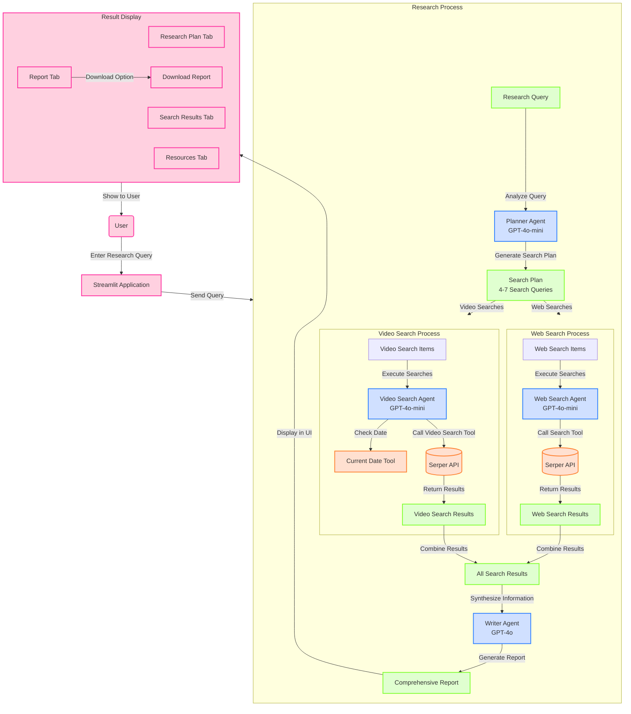

# AI Deep Research Assistant

A powerful multi-agent system for comprehensive research on any topic, built using the OpenAI Agent SDK and Streamlit.

## Overview

This project orchestrates multiple specialized AI agents to produce in-depth research reports:

1. **Planning Agent** - Creates a strategic research plan with diverse search queries
2. **Web Search Agent** - Performs web searches and analyzes results
3. **Video Search Agent** - Identifies high-quality educational videos
4. **Writer Agent** - Synthesizes findings into a comprehensive report

## Features

- Parallel execution of multiple search queries for faster results
- Seamless orchestration of specialized agents
- Beautiful Streamlit interface with tabs for each research stage
- Downloadable comprehensive research reports with citations
- Video recommendations from trusted sources

## System Workflow



## Project Structure

```
research_app/
├── app.py               # Main Streamlit application
├── requirements.txt     # Project dependencies
├── tools/               # Search and utility tools
│   ├── __init__.py      
│   ├── search_tools.py  # Web and video search tools
│   └── date_tools.py    # Date-related tools
├── workers/             # Agent definitions
│   ├── __init__.py      
│   ├── planner.py       # Planning agent
│   ├── web_search.py    # Web search agent
│   ├── video_search.py  # Video search agent
│   └── writer.py        # Report writer agent
└── models/              # Data models
    ├── __init__.py      
    └── schemas.py       # Pydantic schemas
```

## Installation

1. Clone this repository
2. Install dependencies:
   ```
   pip install -r requirements.txt
   ```
3. Set up your API keys:
   - OpenAI API key for agent functionality
   - Serper API key for web search capabilities

## Usage

Run the application:
```
streamlit run app.py
```

In the web interface:
1. Enter your API keys in the sidebar (if not set in environment)
2. Enter your research topic
3. Click "Start Deep Research"
4. Explore the results in the different tabs:
   - Research Plan - View the search strategy
   - Search Results - View findings from web and video searches  
   - Report - See the comprehensive research report
   - Resources - Explore key insights and recommended videos

## Requirements

- Python 3.8+
- Streamlit
- Pydantic
- OpenAI Agent SDK
- Python-dotenv
- Requests

